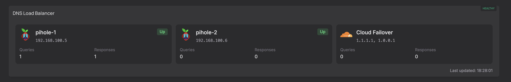
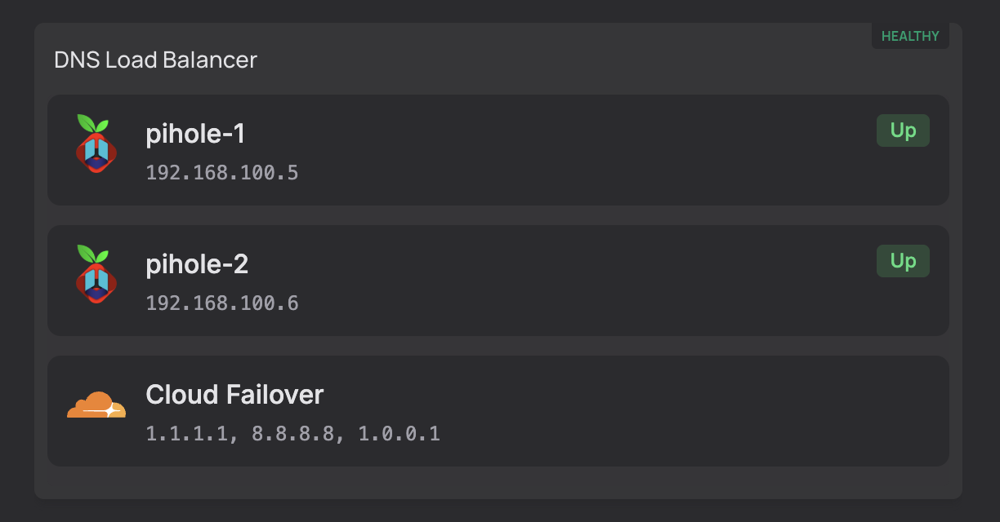

# dnsdist-sidecar

[](https://github.com/StelianMorariu/losmuertos-dnsdist/pkgs/container/dnsdist-sidecar)

A lightweight iFrame widget for [Homepage](https://gethomepage.dev) that displays live status from a [dnsdist](https://dnsdist.org) DNS load balancer.

| Detail | Compact |
|---|---|
|  |  |

## What it does

Queries the dnsdist REST API on a configurable interval and renders a small dashboard showing:

- **Primary servers** (Pi-hole instances) — name, IP, Up/Down state, query and response counts, with optional links to each Pi-hole admin UI
- **Cloud Failover** — aggregated view of fallback resolvers (e.g. Cloudflare), with combined query/response totals
- **Overall health** — exposed via a `/health` endpoint (HTTP 200 = healthy, 503 = unreachable) for Docker and Homepage health checks

The page auto-refreshes client-side via `fetch` on a configurable interval. If the dnsdist API is unreachable, the last known server state is preserved in the UI.

## Usage

### Docker Compose

```yaml
services:
  dnsdist-sidecar:
    image: ghcr.io/stelianmorariu/dnsdist-sidecar:latest
    ports:
      - "8000:8000"
    environment:
      DNSDIST_URL: http://dnsdist:8083
      DNSDIST_API_KEY: your-api-key
      PIHOLE1_HREF: http://pihole1/admin
      PIHOLE2_HREF: http://pihole2/admin
      PRIMARY_THRESHOLD: 10      # servers with order < threshold are primaries
      REFRESH_INTERVAL: 10000    # milliseconds
    volumes:
      - ./config.json:/app/config.json  # optional: override layout
    restart: unless-stopped
```

### Homepage iFrame widget

```yaml
- DNS:
    - dnsdist:
        widget:
          type: iframe
          src: http://dnsdist-sidecar:8000
          classes: h-36
```

## Environment variables

| Variable | Required | Default | Description |
|---|---|---|---|
| `DNSDIST_URL` | Yes | — | Base URL of the dnsdist API (e.g. `http://dnsdist:8083`) |
| `DNSDIST_API_KEY` | Yes | — | dnsdist API key (`setWebserverConfig` in dnsdist config) |
| `PIHOLE1_HREF` | No | `#` | Link target for the first primary server card |
| `PIHOLE2_HREF` | No | `#` | Link target for the second primary server card |
| `PRIMARY_THRESHOLD` | No | `10` | Servers with `order < threshold` are shown as primaries |
| `REFRESH_INTERVAL` | No | `10000` | Page refresh interval in milliseconds |
| `IS_DEV` | No | — | Set to `true` to load data from `dev-data.json` instead of the API |

## Layout configuration

The display layout is controlled by `config.json`. The default is baked into the image — volume-mount your own copy to override it without rebuilding.

```json
{
  "layout": "auto",
  "primaryServerIcon": "https://cdn.jsdelivr.net/gh/homarr-labs/dashboard-icons/webp/pi-hole-unbound.webp",
  "secondaryServerIcon": "https://cdn.jsdelivr.net/gh/homarr-labs/dashboard-icons/webp/pi-hole-unbound.webp",
  "failoverServerIcon": "https://raw.githubusercontent.com/homarr-labs/dashboard-icons/main/svg/cloudflare.svg"
}
```

| Key | Default | Description |
|---|---|---|
| `layout` | `auto` | `auto` — detail when ≥ 834px wide, compact otherwise; `detail` — always 3-column with stats; `compact` — always single-column, stats hidden |
| `primaryServerIcon` | Pi-hole Unbound icon | URL of the icon shown on the first primary server card |
| `secondaryServerIcon` | Pi-hole Unbound icon | URL of the icon shown on the second primary server card |
| `failoverServerIcon` | Cloudflare icon | URL of the icon shown on the cloud failover card |

Changes to `config.json` take effect on the next browser refresh — no container restart needed.

## Endpoints

| Endpoint | Description |
|---|---|
| `GET /` | The dashboard HTML page |
| `GET /data` | JSON data used by the page (primaries, fallbacks, config) |
| `GET /health` | `200 OK` if last dnsdist fetch succeeded, `503` otherwise |

## Local development

```bash
cp .env.example .env   # fill in your values, or set IS_DEV=true
node src/server.js
```

With `IS_DEV=true`, the server reads from `dev-data.json` in the project root instead of calling the dnsdist API. Edit `src/index.html` and refresh the browser — no server restart needed.
